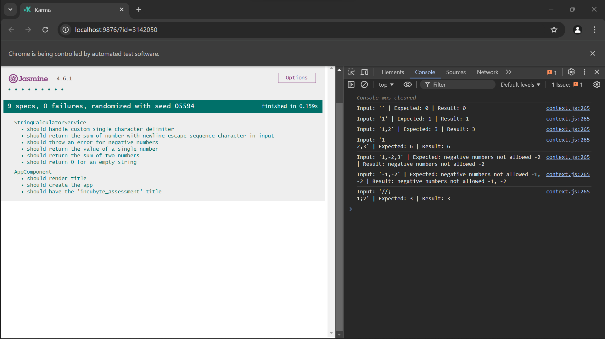

# IncubyteAssessment

### Screenshot of Jasmine Test Results

### Projet Setup
1. I initialize the project with Angular CLI, I did not want to add any other dependencies. I wanted to use the basic Angular framework to build the project.
2. I created a simple service to handle the string calculation.
3. Created tests for the same service
4. I was following the TDD approach, so I started with the simplest test and then wrote the code to pass the test. https://blog.incubyte.co/blog/tdd-assessment/
5. I added more tests to cover more scenarios.
6. Deployed the assessment on https://incubyte-assessment.vercel.app/ (Open DevTools console window to see simple output by app comp)

This project was generated with [Angular CLI](https://github.com/angular/angular-cli) version 18.2.4.

## Development server

Run `ng serve` for a dev server. Navigate to `http://localhost:4200/`. The application will automatically reload if you change any of the source files.

## Code scaffolding

Run `ng generate component component-name` to generate a new component. You can also use `ng generate directive|pipe|service|class|guard|interface|enum|module`.

## Build

Run `ng build` to build the project. The build artifacts will be stored in the `dist/` directory.

## Running unit tests

Run `ng test` to execute the unit tests via [Karma](https://karma-runner.github.io).

## Running end-to-end tests

Run `ng e2e` to execute the end-to-end tests via a platform of your choice. To use this command, you need to first add a package that implements end-to-end testing capabilities.

## Further help

To get more help on the Angular CLI use `ng help` or go check out the [Angular CLI Overview and Command Reference](https://angular.dev/tools/cli) page.

